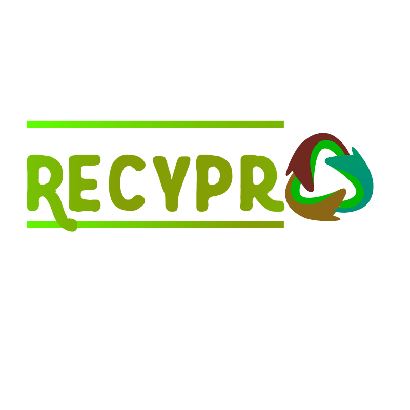

# RecyPro: Un proyecto innovador de reciclaje y responsabilidad social

## Descripción del propósito, objetivos y beneficios

RecyPro es un proyecto revolucionario que busca abordar el problema del desperdicio y la contaminación mediante el fomento de la reutilización, el reciclaje y la creación de arte y productos a partir de materiales reciclados. El proyecto se centra en la creación de una plataforma web y una aplicación móvil que incluirán tutoriales, una tienda en línea, un blog y colaboraciones con entidades medioambientales.

## Objetivos principales:

Promover la conciencia y la educación sobre el reciclaje y la reutilización de materiales.
Facilitar la creación y venta de productos y arte reciclados a través de una plataforma accesible y fácil de usar.
Generar oportunidades económicas para comunidades desfavorecidas, permitiendo la participación de cualquier persona interesada en reciclar y generar ingresos.
Establecer alianzas con organizaciones, comunidades y gobiernos para implementar soluciones medioambientales y programas de limpieza y reciclaje.
Crear una criptomoneda (token) para financiar actividades y soluciones medioambientales.

## Beneficios del proyecto

Reducción del impacto medioambiental al fomentar el reciclaje y la reutilización de materiales.
Generación de oportunidades económicas para comunidades desfavorecidas.
Creación de una comunidad global comprometida con la protección del medio ambiente y la responsabilidad social.
Contribución a la educación y la conciencia medioambiental a través de la plataforma web y la aplicación móvil.

## Colaboración y habilidades requeridas

Para llevar a cabo el proyecto RecyPro, necesitamos colaboradores con diversas habilidades, tales como:

Desarrolladores web y móviles para crear la plataforma y la aplicación.
Expertos en marketing digital y SEO para promover la plataforma y optimizar la tienda en línea.
Diseñadores gráficos y UX/UI para diseñar la plataforma y el contenido visual.
Creadores de contenido, expertos y activistas medioambientales para generar tutoriales, noticias y análisis.
Desarrolladores y expertos en blockchain para crear y gestionar la criptomoneda (token).
Coordinadores y gestores de proyectos para dirigir y organizar las diferentes etapas y colaboraciones del proyecto.

## Impacto social y medioambiental

RecyPro es un proyecto con un fuerte impacto social y medioambiental. Al centrarse en la reutilización, el reciclaje y la creación de productos y arte a partir de materiales reciclados, el proyecto aborda directamente el problema de la contaminación y el desperdicio. Además, al ofrecer oportunidades económicas a comunidades desfavorecidas y establecer alianzas con entidades medioambientales, RecyPro tiene el potencial de generar un cambio significativo y duradero en la protección del medio ambiente y el bienestar de las comunidades involucradas.

## Contribución y recompensas en tokens

Para incentivar y recompensar a los colaboradores, ofrecemos tokens RecyPro como una forma de reconocimiento y participación en el éxito del proyecto. Los tokens se pueden utilizar para acceder a servicios y productos dentro de la plataforma o se pueden cambiar por otras criptomonedas en el mercado.

## Distribución de tokens

La cantidad total de tokens RecyPro será de 100.000.000. La distribución de tokens se realizará de la siguiente manera:

Socios y fundadores: 2% (2.000.000 tokens)
Colaboradores y recompensas: 75% (75.000.000 tokens)
Investigación e implementación de soluciones innovadoras: 13% (13.000.000 tokens)
Reserva para futuras colaboraciones y desarrollo del proyecto: 10% (10.000.000 tokens)

## Recompensas por colaboración

Las recompensas en tokens RecyPro se distribuirán según la contribución y el valor aportado al proyecto. A continuación, se muestra un ejemplo de recompensas para diferentes roles y contribuciones:

Desarrolladores web y móviles: 5.000 - 20.000 tokens por proyecto completado, según la complejidad y el tiempo dedicado.
Expertos en marketing digital y SEO: 2.000 - 10.000 tokens por campaña exitosa o metas alcanzadas.
Diseñadores gráficos y UX/UI: 1.000 - 5.000 tokens por diseño o proyecto completado.
Creadores de contenido y activistas medioambientales: 500 - 2.000 tokens por artículo, tutorial o análisis.
Desarrolladores y expertos en blockchain: 5.000 - 20.000 tokens por proyecto completado o metas alcanzadas.
Coordinadores y gestores de proyectos: 2.000 - 8.000 tokens por proyecto exitosamente gestionado y completado.
